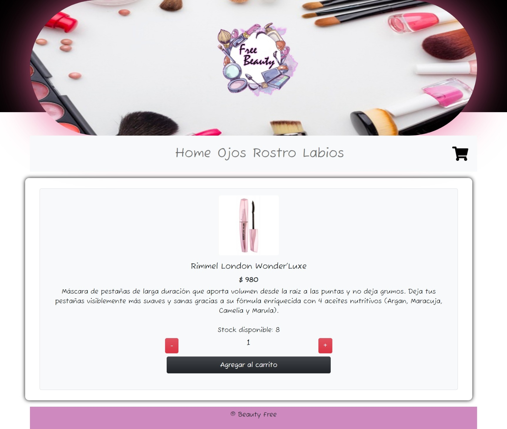
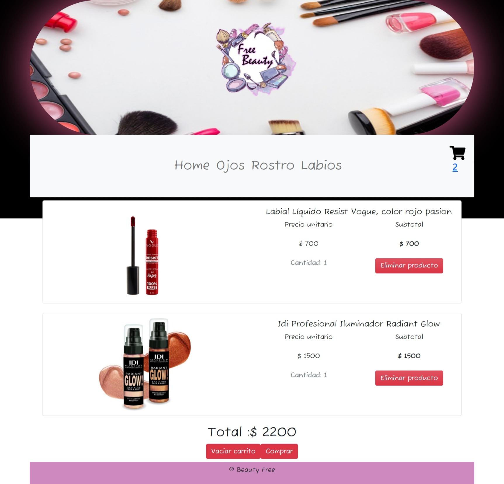
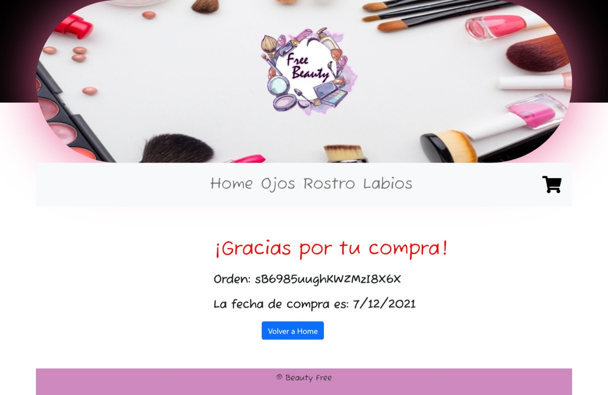
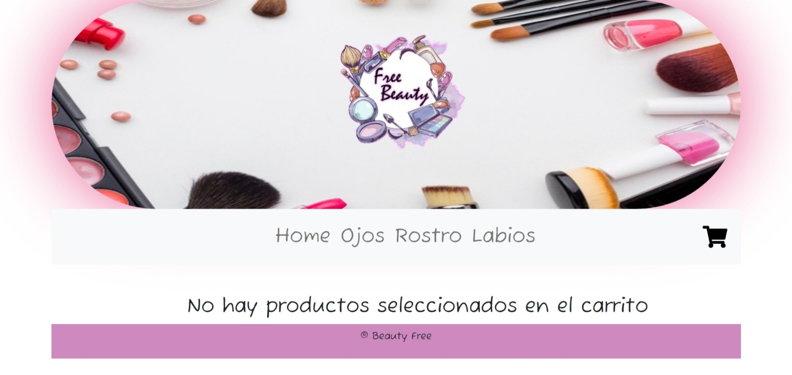

**Beauty Free - React.js** 

# *Entrega final de React Comision 16975:*
**Nombre:** 
Rocio 

**Apellido:** 
Bogado

**Profesor:** 
Horacio Gutierrez

- - -

## **Sobre Beauty Free**
Es un E-commerse que se dedica a la venta de maquillajes de primeras marcas al mejor precio del mercado para que puedas regalar o regalarte.

Las marcas que comercializamos son:

- Maybelline
- Rimmel
- Loreal
- MAC
- IDI
- Revlon
- Vogue

- - -

## **La Navegacion incluye:**

**_Home:_**

Incluye las cards con todos los productos.

**_Ojos:_**

Las cards que contienen productos para maquillarse los ojos.

**_Rostro:_**

Las cards que contienen productos para maquillarse el rostro.

**_Labios:_**

Las cards que contienen productos para maquillarse los labios.

**_Carrito:_**

Un carrito donde se pueden ver todos los productos que "agregaste al carrito".

- - -

## **Interfaz del Usuario:**

El usuario puede agregar un producto al carrito desde el Home o seleccionar la categoria correspondiente para filtrar los productos (ojos, rostro, labios) y desde ahi añadir el producto al carrito apretando primero en el boton de "VER MAS" y luego en "Agregar al carrito"

En la barra de navegación, en donde esta el icono del carrito muestra la cantidad de productos que el usuario agrega al carrito.

Una vez que se agregan todos los productos que se quieren comprar, vas al boton "Terminar compra" y se ven en detalle todos los productos y cantidades seleccionadas anteriormente.

Ademas estan los botones "Eliminar producto" en caso de querer eliminar un producto en particular y el boton "Vaciar carrito" en caso de querer eliminar todos los productos antriormente seleccionados.

Por ultimo en caso de querer finalizar la compra, cuando se apreta el boton "Comprar" aparece un mensaje en pantalla informando que se realizo la compra, el ID de compra junto con la fecha que se realizo y un boton para volver a Home.
- - -

## **Tecnologias utilizadas:**

- React JS (https://reactjs.org/)
- Create React App (https://create-react-app.dev/)
- Estilos con Bootstrap y CSS (https://getbootstrap.com/)
- Ruteo con React Router Dom (https://reactrouter.com/)
- Icons con React-Icons (https://react-icons.github.io/react-icons/)
- La base de datos con Firebase (https://firebase.google.com/)


**Firebase/Backend:**

El backend esta realizado con Firebase.
En la consola del Firebase use los siguientes campos:

- **id:** automatico, generado por firebase.
- **descr:** descripcion del producto.
- **imagen:** imagen del producto.
- **precio:** precio.
- **stock:** stock.
- **titulo:** nombre del producto/titulo.

***

## **Capturas de pantalla del E-commerse del flujo de compra:**
### 1. Home:
## 

### 2. Detalle del producto seleccionado:
## 

### 3. Carrito de compras, con productos seleccionados:
## 


### 4. Luego de apretar el boton "Comprar":
## 

### 5. Si no hay productos en el carrito:
## 

***

# *Como descargar y usar el proyecto:*
* ### **Clonar repositorio:**
Clonar el repositorio del Ecommerse a traves del GitHub, del siguiente enlance:

```bash
https://github.com/robogado/appreact.git
```


* ### **Instalacion:**
Descomprimir la carpeta y abrirla descomprida en la terminal de Visual Studio Code y luego ingresar el siguiente comando:

```bash
  npm install
```

Para instalar las dependencias necesarias.

* ### **Inicializar el proyecto:**
Por ultimo, una vez que se finaliza de instalar las dependencias necesarias en la terminal del Visual Studio Code ingresar el siguiente comando para abrir el proyecto:


```bash
  npm run start
```
***

# ** Información por defecto, con *`Create React App:`* **

This project was bootstrapped with [Create React App](https://github.com/facebook/create-react-app).

## Available Scripts

In the project directory, you can run:

### `npm start`

Runs the app in the development mode.\
Open [http://localhost:3000](http://localhost:3000) to view it in the browser.

The page will reload if you make edits.\
You will also see any lint errors in the console.

### `npm test`

Launches the test runner in the interactive watch mode.\
See the section about [running tests](https://facebook.github.io/create-react-app/docs/running-tests) for more information.

### `npm run build`

Builds the app for production to the `build` folder.\
It correctly bundles React in production mode and optimizes the build for the best performance.

The build is minified and the filenames include the hashes.\
Your app is ready to be deployed!

See the section about [deployment](https://facebook.github.io/create-react-app/docs/deployment) for more information.

### `npm run eject`

**Note: this is a one-way operation. Once you `eject`, you can’t go back!**

If you aren’t satisfied with the build tool and configuration choices, you can `eject` at any time. This command will remove the single build dependency from your project.

Instead, it will copy all the configuration files and the transitive dependencies (webpack, Babel, ESLint, etc) right into your project so you have full control over them. All of the commands except `eject` will still work, but they will point to the copied scripts so you can tweak them. At this point you’re on your own.

You don’t have to ever use `eject`. The curated feature set is suitable for small and middle deployments, and you shouldn’t feel obligated to use this feature. However we understand that this tool wouldn’t be useful if you couldn’t customize it when you are ready for it.

## Learn More

You can learn more in the [Create React App documentation](https://facebook.github.io/create-react-app/docs/getting-started).

To learn React, check out the [React documentation](https://reactjs.org/).

### Code Splitting

This section has moved here: [https://facebook.github.io/create-react-app/docs/code-splitting](https://facebook.github.io/create-react-app/docs/code-splitting)

### Analyzing the Bundle Size

This section has moved here: [https://facebook.github.io/create-react-app/docs/analyzing-the-bundle-size](https://facebook.github.io/create-react-app/docs/analyzing-the-bundle-size)

### Making a Progressive Web App

This section has moved here: [https://facebook.github.io/create-react-app/docs/making-a-progressive-web-app](https://facebook.github.io/create-react-app/docs/making-a-progressive-web-app)

### Advanced Configuration

This section has moved here: [https://facebook.github.io/create-react-app/docs/advanced-configuration](https://facebook.github.io/create-react-app/docs/advanced-configuration)

### Deployment

This section has moved here: [https://facebook.github.io/create-react-app/docs/deployment](https://facebook.github.io/create-react-app/docs/deployment)

### `npm run build` fails to minify

This section has moved here: [https://facebook.github.io/create-react-app/docs/troubleshooting#npm-run-build-fails-to-minify](https://facebook.github.io/create-react-app/docs/troubleshooting#npm-run-build-fails-to-minify)

